# Primeiro Trabalho — MSAD 2026.1

**Caracterização estatística de séries temporais e sequências de dados**

Autor: análise automatizada com `scripts/analise_trabalho.py`  
Dados: `data/Bellcore_data.txt`, `data/Silence_of_the_Lambs_movietrace_data.txt`

---

## Sumário

1. [Bellcore Ethernet trace](#1-bellcore-ethernet-trace)
2. [Silence of the Lambs movie trace](#2-silence-of-the-lambs-movie-trace)
3. [Como reproduzir](#como-reproduzir)

---

## 1. Bellcore Ethernet trace

Trace com **1.000.000** pacotes no formato `<tempo (s)> <tamanho (bytes)>`.

### 1.a) Estatísticas do tamanho dos pacotes (sequência original)

| Estatística | Valor |
|-------------|------:|
| N | 1 000 000 |
| Média | 638,29 bytes |
| Variância | 269 548,78 |
| Desvio padrão | 519,18 bytes |
| Mínimo | 64 |
| Máximo | 1518 |
| Mediana | 1082 |
| Skewness | 0,067 |
| Kurtosis (não excesso) | 1,263 |

**Histograma e CDF (original):**

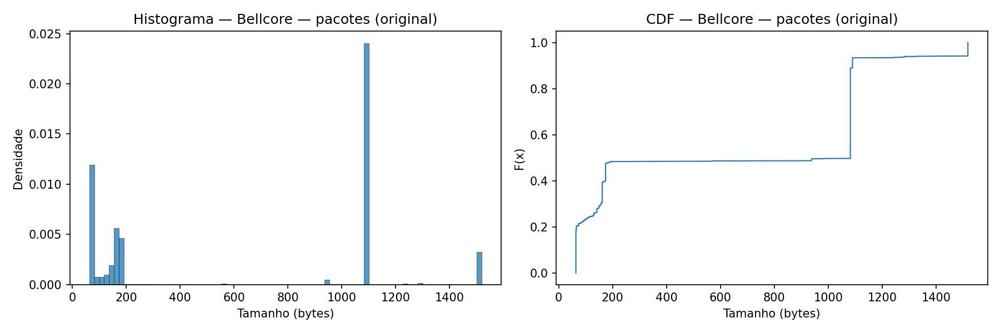

**Interpretação:** a distribuição é **fortemente bimodal**: picos em pacotes pequenos (64 B, típico de ACKs/controle) e em ~1518 B (tamanho próximo ao MTU Ethernet). A média fica entre esses modos; a mediana (1082 B) reflete maior massa em pacotes grandes. Skewness quase nula e kurtosis baixa (< 3) indicam caudas leves na visão global, mas o histograma mostra que isso é efeito da mistura de dois regimes, não de uma única distribuição unimodal.

---

### 1.b) Agregação em intervalos de 100 ms e 1 s

Para cada intervalo foram calculados:

- **tamanho médio** dos pacotes no intervalo (bytes);
- **número de pacotes** no intervalo.

| Agregação | Nº de intervalos | Média do tamanho médio | Média da contagem/intervalo |
|-----------|------------------:|-----------------------:|------------------------------:|
| 100 ms | 17 593 | 618,96 B | 56,84 pacotes |
| 1 s | 1 760 | 624,90 B | 568,18 pacotes |

Os traces agregados suavizam flutuações pacote a pacote e passam a descrever o comportamento **em escala de tempo**.

---

### 1.c) Estatísticas das agregações e comparação com o original

Comparação do **tamanho médio por intervalo** (item b) com a sequência original de tamanhos de pacote:

| Sequência | N | Média | Variância | σ | Skewness | Kurtosis |
|-----------|--:|------:|----------:|--:|---------:|---------:|
| Original (pacotes) | 1 000 000 | 638,29 | 269 549 | 519,18 | 0,067 | 1,263 |
| Agreg. 100 ms | 17 593 | 618,96 | 39 245 | 198,10 | −0,644 | 3,271 |
| Agreg. 1 s | 1 760 | 624,90 | 15 309 | 123,73 | −0,771 | 3,781 |

**Histogramas e CDFs das agregações:**

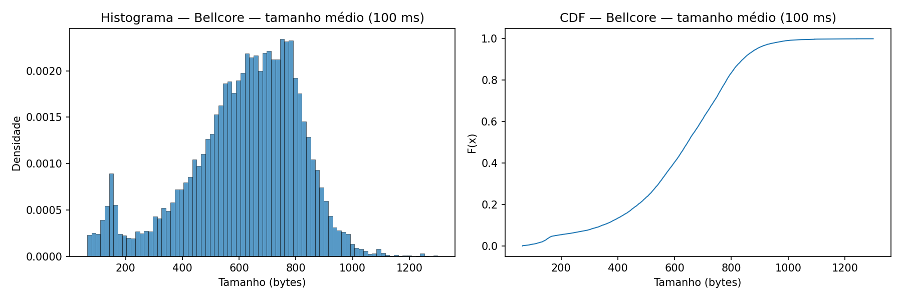

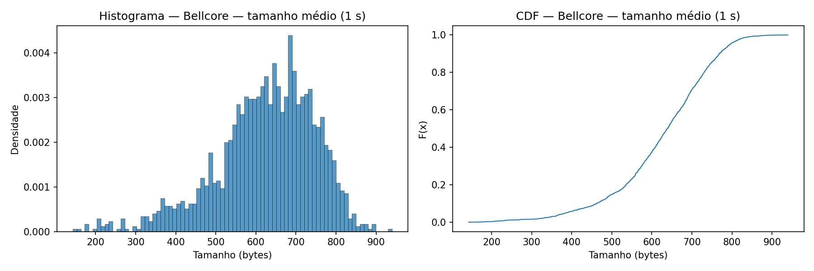

**Comparação:**

- A **variância cai drasticamente** com a agregação (de ~2,7×10⁵ para ~1,5×10⁴ em 1 s), pois a média por intervalo elimina o efeito bimodal pacote a pacote.
- A média permanece próxima (~619–625 B vs 638 B original).
- Skewness passa de ~0 para **negativo** (cauda à esquerda nos tamanhos médios agregados).
- Kurtosis aumenta e aproxima-se de 3 (distribuição mais “em sino” que a original).
- O suporte máximo do tamanho médio diminui (1300 B em 100 ms; ~940 B em 1 s), refletindo maior suavização em bins maiores.

---

### 1.d) Skewness e kurtosis (três sequências)

| Sequência | Skewness | Kurtosis |
|-----------|----------:|---------:|
| Original | 0,067 | 1,263 |
| Agregação 100 ms (tamanho médio) | −0,644 | 3,271 |
| Agregação 1 s (tamanho médio) | −0,771 | 3,781 |

A agregação temporal **altera os momentos de ordem superior**: a sequência original mistura dois modos; após agregar, a distribuição dos tamanhos médios torna-se mais simétrica em escala log, com skew negativo moderado e kurtosis próxima da normal.

---

### 1.e) Ajuste de distribuições de probabilidade (MLE + critério AIC)

Foram testadas: Normal, Lognormal, Exponencial, Gamma, Weibull e Pareto. Melhor ajuste por **menor AIC** (empates resolvidos pelo KS quando aplicável):

#### Sequência original

| Distribuição | AIC | KS stat. | Melhor? |
|--------------|----:|---------:|:-------:|
| **Pareto** | 14 820 059 | 0,311 | ✓ |
| Weibull | 14 917 105 | 0,320 | |
| Gamma | 14 917 445 | 0,319 | |
| Exponencial | 14 917 589 | 0,319 | |
| Lognormal | 14 996 482 | 0,321 | |

Parâmetros Pareto (shape ≈ 0,58, scale ≈ 64 B): indica cauda pesada, mas o **KS rejeita** o ajuste (p ≈ 0) por causa da **bimodalidade** — nenhuma distribuição unimodal descreve bem todos os pacotes.

#### Agregação 100 ms (tamanho médio)

| Distribuição | AIC | KS stat. |
|--------------|----:|---------:|
| **Normal** | 236 021 | 0,060 |
| Weibull | 236 298 | 0,060 |
| Gamma | 241 195 | 0,124 |

A **Normal** (μ ≈ 619 B, σ ≈ 198 B) é a melhor aproximação entre as testadas.

#### Agregação 1 s (tamanho médio)

| Distribuição | AIC | KS stat. | KS p-value |
|--------------|----:|---------:|-----------:|
| **Weibull** | 21 827 | 0,028 | 0,114 |
| Normal | 21 957 | 0,049 | 4,6×10⁻⁴ |
| Gamma | 22 253 | 0,085 | ~0 |

Para 1 s, **Weibull** apresenta melhor AIC e único KS não rejeitado ao nível 5% entre as melhores — aproximação razoável para o tamanho médio agregado.

**Conclusão (e):** o trace **original** exige modelos mistos ou empíricos; após agregação temporal, **Normal/Weibull** capturam melhor os tamanhos médios por intervalo.

---

### 1.f) CCDF em escala log–log (cauda pesada)

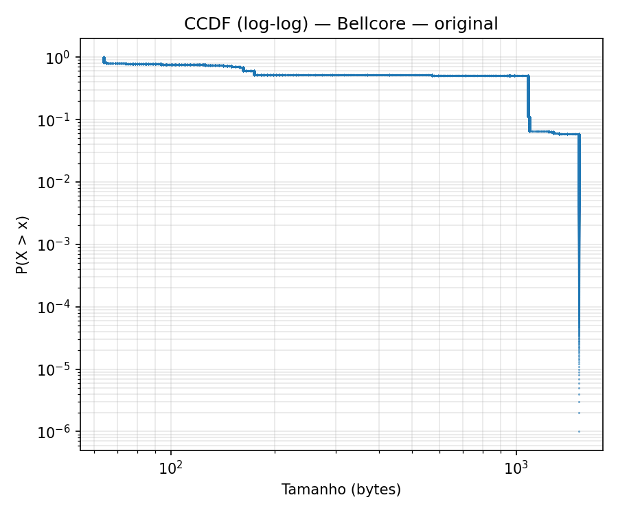

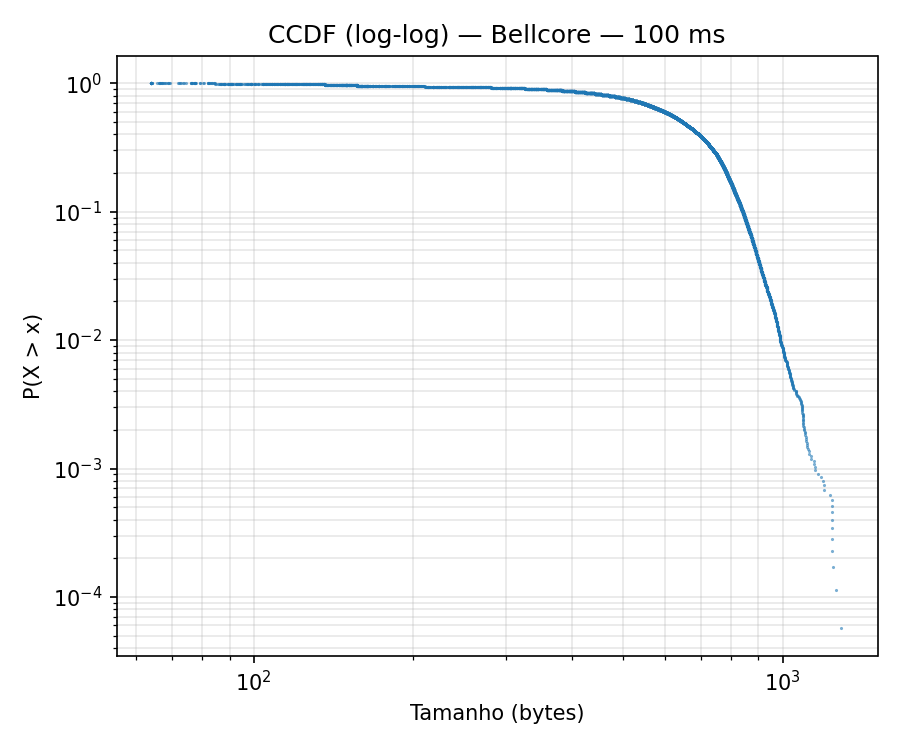

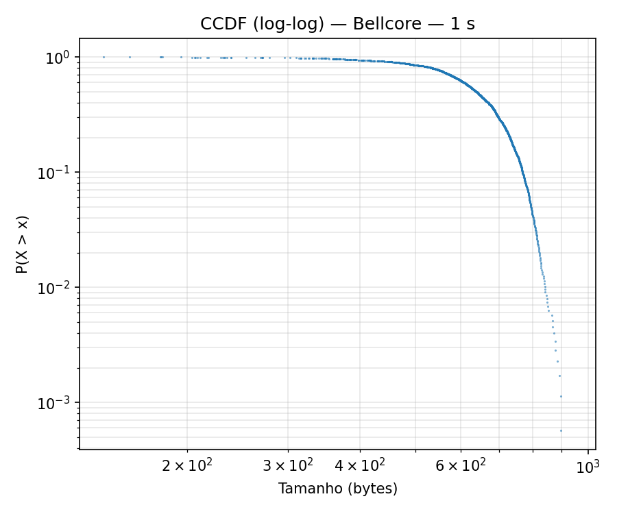

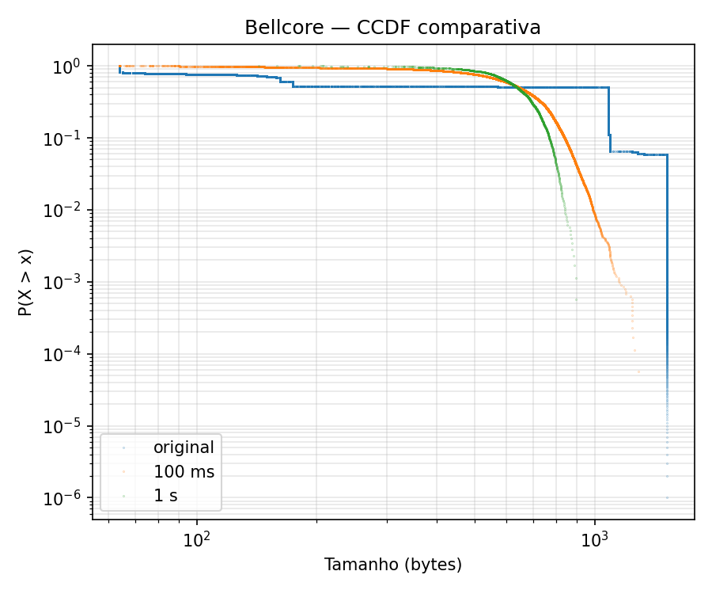

**Inferência:**

- **Original:** trecho aproximadamente linear em log–log em faixas intermediárias, compatível com **cauda pesada** (comportamento tipo lei de potência em parte da CCDF), além de **degrau** próximo a 1518 B (limite MTU) — cauda truncada no máximo.
- **Agregações:** a CCDF cai mais rápido; a inclinação em log–log é menos pronunciada → agregação **reduz** o aspecto de cauda pesada nos tamanhos médios por intervalo.

Indício de cauda pesada: **sim, na sequência original**; **fraco ou ausente** nas agregações de tamanho médio.

---

### 1.g) Autocorrelação (ACF) e dependência de longa duração

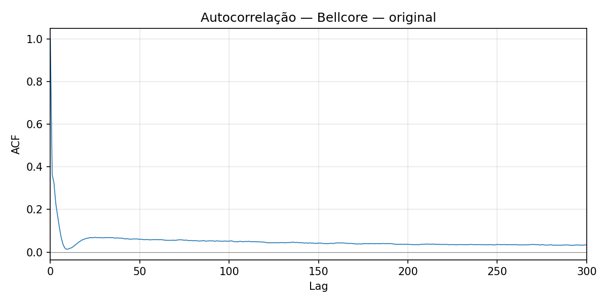

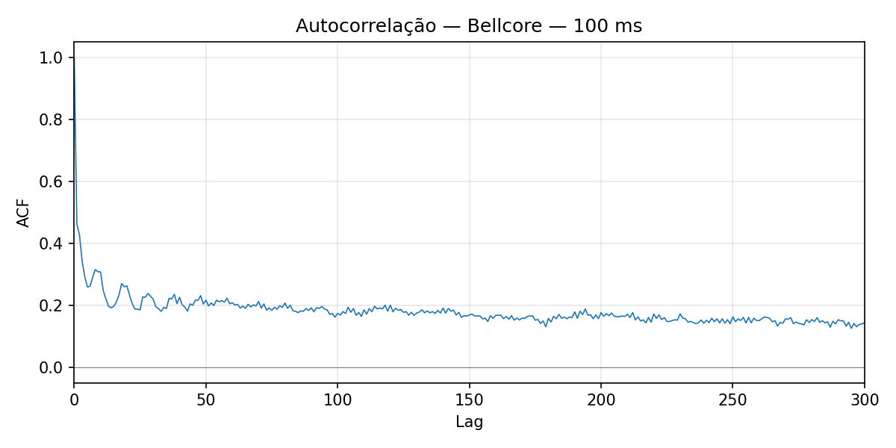

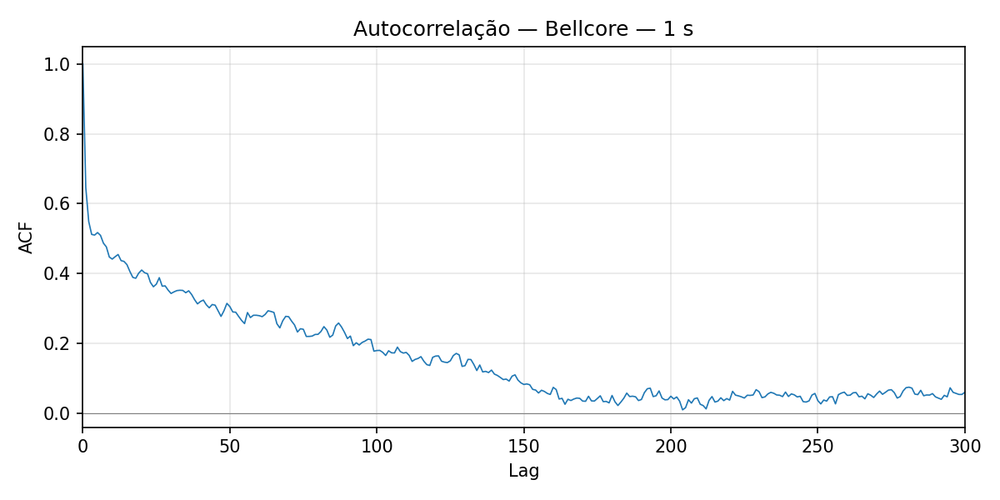

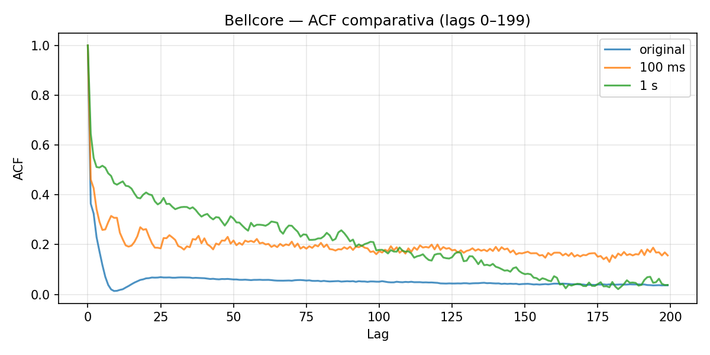

| Sequência | ACF no lag 50 |
|-----------|-------------:|
| Original | 0,060 |
| 100 ms | 0,217 |
| 1 s | 0,305 |

**Interpretação:**

- Na sequência **original**, a ACF decai rápido para lags pequenos (correlação fraca em lag 50), típico de tráfego de rede com bursts curtos.
- Nas **agregações**, a ACF permanece **mais elevada** em lags maiores → a agregação introduz **persistência temporal** (médias e contagens correlacionadas ao longo de centenas de ms ou segundos).
- Há **indício de dependência de longa duração (LRD)** nas séries agregadas: valores positivos e decaimento lento da ACF em comparação com o trace pacote a pacote. Isso é esperado em tráfego auto-similar de rede: agregar revela correlação que se cancela em escala fina.

---

## 2. Silence of the Lambs movie trace

**53 997** frames (colunas usadas: ordem de exibição, tempo de exibição, tipo I/P/B, tamanho em bytes).  
Ordem de **transmissão** = ordem das linhas no arquivo.  
Ordem de **exibição** = ordenação por `display_seq` e `display_time`.

Contagem por tipo: **I** = 3 375 | **P** = 10 125 | **B** = 40 497

---

### 2.a) Estatísticas por tipo de frame e conjunto total

| Tipo | N | Média (B) | Variância | σ (B) | Mediana | Skewness | Kurtosis |
|------|--:|----------:|----------:|------:|--------:|---------:|---------:|
| **I** | 3 375 | 183 776 | 8,71×10⁹ | 93 305 | 159 648 | 1,999 | 9,127 |
| **P** | 10 125 | 111 413 | 4,21×10⁹ | 64 910 | 93 312 | 1,630 | 7,099 |
| **B** | 40 497 | 36 093 | 1,76×10⁹ | 41 922 | 22 336 | 2,555 | 12,707 |
| **Todos** | 53 997 | 59 447 | 4,53×10⁹ | 67 332 | 36 240 | 2,282 | 11,430 |

**Histogramas e CDFs:**

| Tipo | Figura |
|------|--------|
| I | 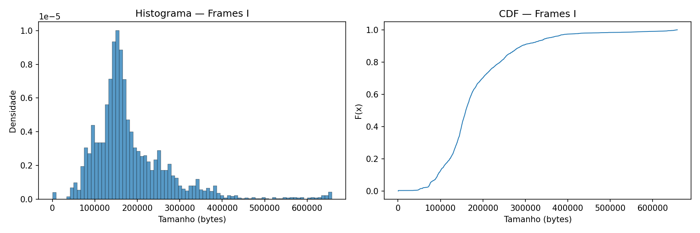 |
| P | 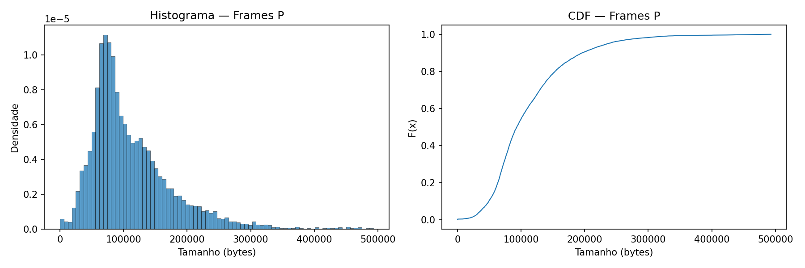 |
| B | 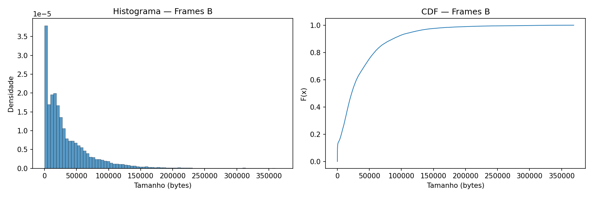 |
| Todos | 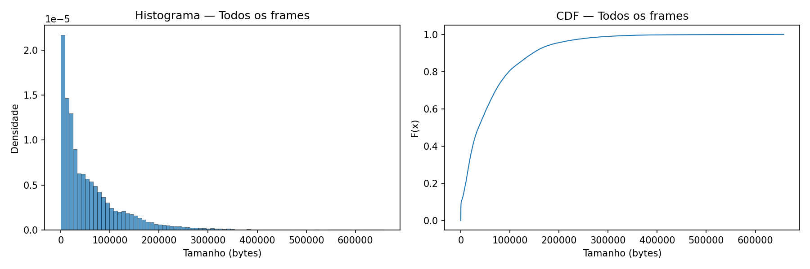 |

**Interpretação:**

- **I > P > B** em tamanho médio (codificação intra vs preditiva vs bidirecional).
- Todos os tipos apresentam **skewness positiva forte** e **kurtosis >> 3** → caudas pesadas à direita (frames muito grandes são raros mas existem).
- Frames **B** são os mais numerosos e os menores em média; **I** são poucos mas dominam o volume de bits em picos.

---

### 2.b) Distribuições de probabilidade (melhor AIC)

| Tipo | Melhor distribuição | Parâmetros (resumo) | AIC |
|------|---------------------|---------------------|----:|
| **I** | Gamma | shape ≈ 4,37, scale ≈ 42 021 | 85 879 |
| **P** | Gamma | shape ≈ 3,12, scale ≈ 35 664 | 250 192 |
| **B** | Gamma | shape ≈ 0,66, scale ≈ 54 589 | 925 510 |
| **Todos** | Gamma | shape ≈ 0,66, scale ≈ 89 444 | 1 288 120 |

Weibull e Lognormal ficam em segundo lugar na maioria dos casos. **Normal e Exponencial** são claramente piores (AIC muito maior).

**Conclusão:** tamanhos de frame MPEG seguem bem uma **Gamma** (ou alternativamente Weibull/Lognormal), refletindo variabilidade positiva e cauda direita; a mistura I/P/B no conjunto total ainda é bem aproximada por Gamma com baixo shape (distribuição muito assimétrica).

---

### 2.c) CCDF log–log (cauda pesada)

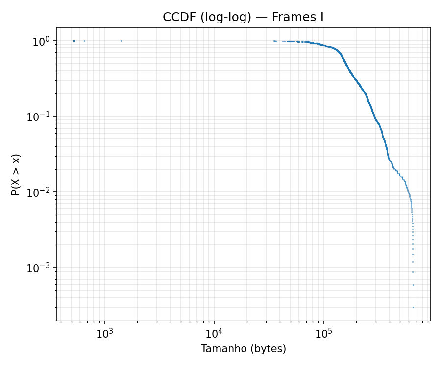

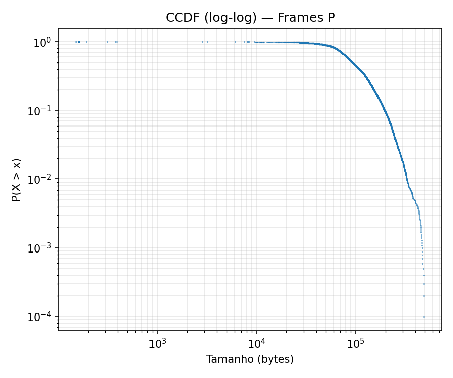

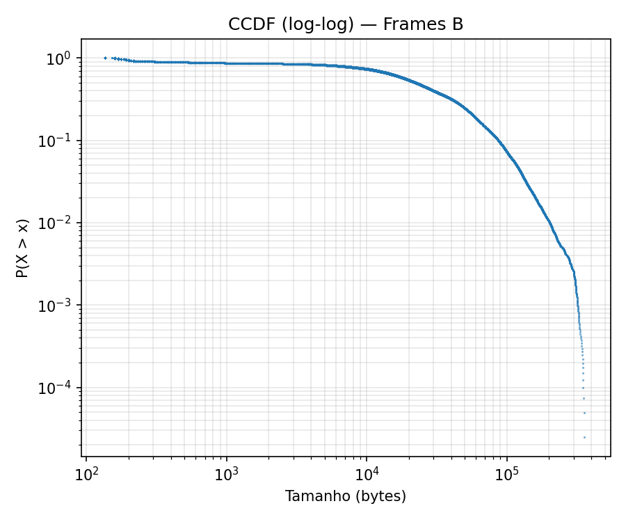

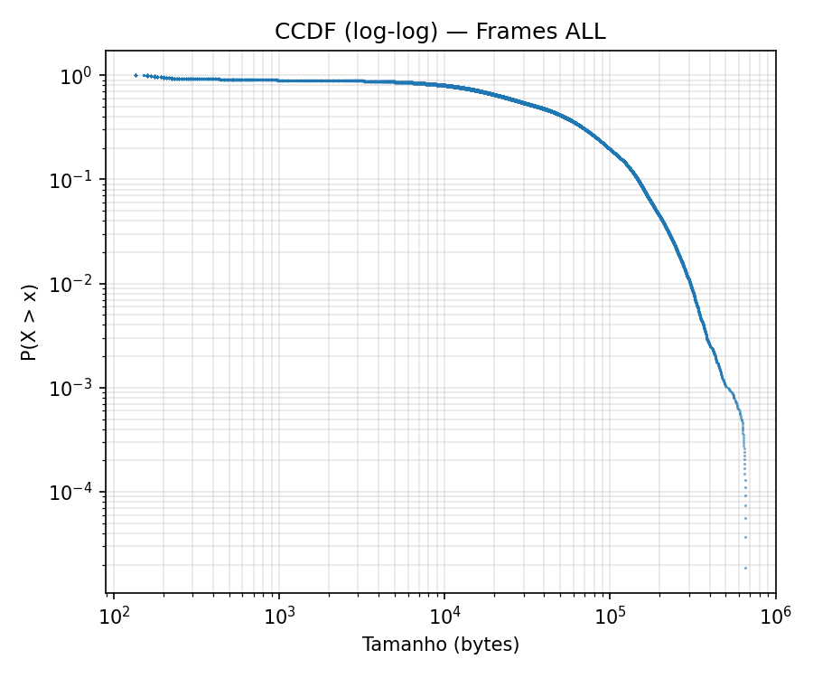

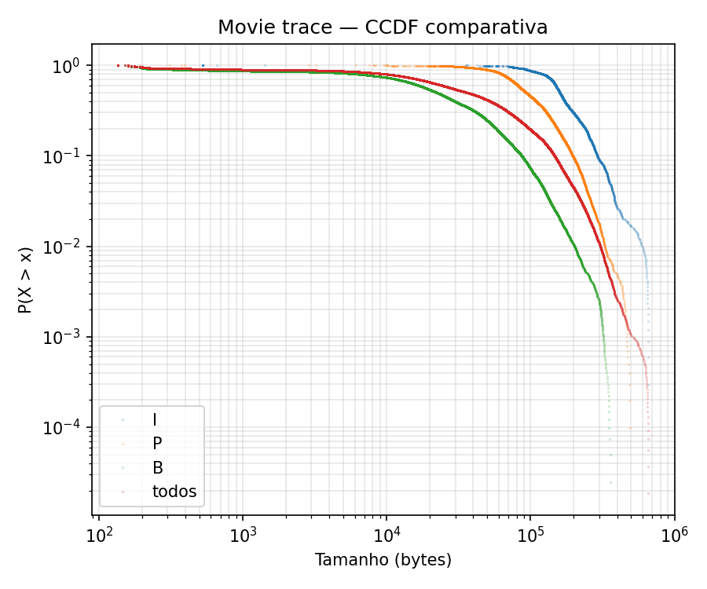

**Inferência:**

- Em **log–log**, as CCDFs de **I, P e ALL** exibem regiões com declínio aproximadamente linear → **forte indício de cauda pesada** (variabilidade extrema em frames grandes).
- **B** também mostra cauda pesada, porém com valores menores e queda mais rápida na cauda.
- O conjunto total herda o comportamento dos tipos I e P (menos frames, mas tamanhos maiores na cauda).

---

### 2.d) Autocorrelação: transmissão vs exibição

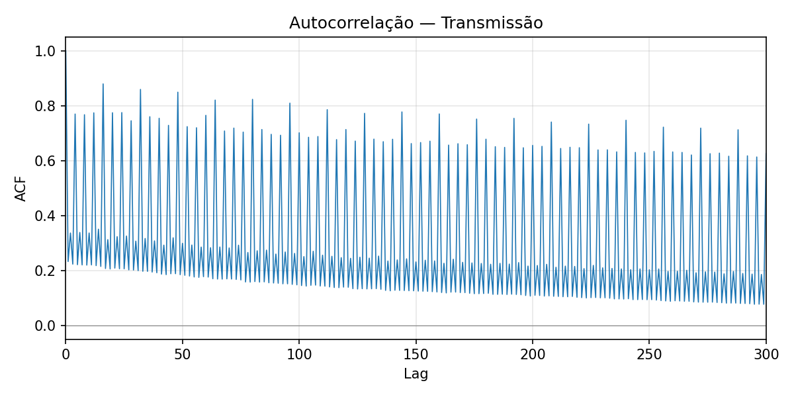

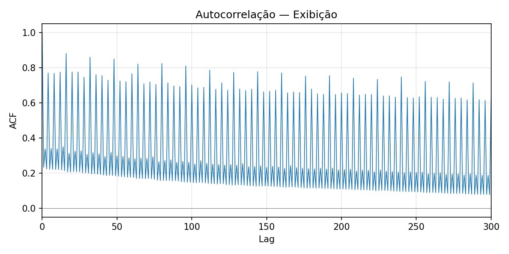

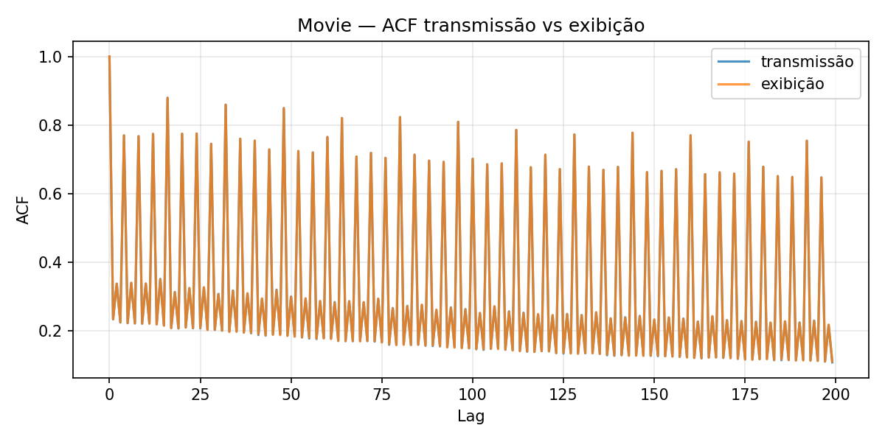

| Ordem | ACF(lag 50) | ACF(lag 100) |
|-------|------------:|-------------:|
| Transmissão | 0,299 | 0,701 |
| Exibição | 0,298 | 0,701 |

**Interpretação:**

- Ambas as ordens apresentam **ACF elevada e decaimento lento** — padrão de **dependência de longa duração**: tamanhos de frame correlacionam ao longo de dezenas/centenas de frames (estrutura GOP MPEG: sequências I-P-B repetidas).
- **Transmissão vs exibição:** curvas quase **idênticas** nos lags analisados; reordenar para exibição não remove a estrutura de dependência temporal dos tamanhos, pois o conjunto de valores é o mesmo, apenas permutado em blocos GOP — a periodicidade I/P/B preserva autocorrelação similar.
- Picos na ACF em múltiplos de ~12 frames (padrão GOP típico) são visíveis nos gráficos → **periodicidade** + LRD.

---

## Conclusões gerais

| Aspecto | Bellcore | Movie trace |
|---------|----------|-------------|
| Forma da distribuição | Bimodal (original); unimodal após agregar | Fortemente assimétrica; I > P > B |
| Melhor modelo | Pareto (original, limitado); Normal/Weibull (agregado) | Gamma |
| Cauda pesada (CCDF) | Sim (original) | Sim (todos os tipos) |
| LRD (ACF) | Mais evidente após agregação | Sim, transmissão e exibição |

---

## Como reproduzir

```bash
cd /Users/mac/Documents/msad-01
pip install -r requirements.txt
export MPLCONFIGDIR=.matplotlib
python3 scripts/analise_trabalho.py
```

Saídas:

- Figuras: `figures/`
- Métricas JSON: `results/metricas.json`
- Notebook interativo: `notebooks/trabalho_msad.ipynb`

---

*Documento gerado a partir da execução de `scripts/analise_trabalho.py` em 24/05/2026.*
